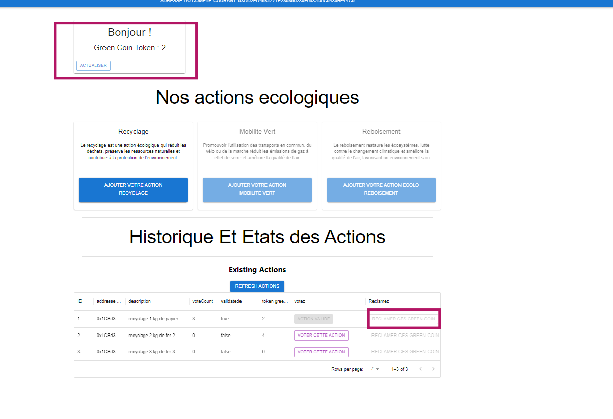

# Getting Started with Create React App

This project was bootstrapped with [Create React App](https://github.com/facebook/create-react-app).

## Available Scripts

In the project directory, you can run:

### `npm start`

Runs the app in the development mode.\
Open [http://localhost:3000](http://localhost:3000) to view it in your browser.

The page will reload when you make changes.\
You may also see any lint errors in the console.

### `npm test`

Launches the test runner in the interactive watch mode.\
See the section about [running tests](https://facebook.github.io/create-react-app/docs/running-tests) for more information.

### `npm run build`

Builds the app for production to the `build` folder.\
It correctly bundles React in production mode and optimizes the build for the best performance.

The build is minified and the filenames include the hashes.\
Your app is ready to be deployed!

See the section about [deployment](https://facebook.github.io/create-react-app/docs/deployment) for more information.

### `npm run eject`

**Note: this is a one-way operation. Once you `eject`, you can't go back!**

If you aren't satisfied with the build tool and configuration choices, you can `eject` at any time. This command will remove the single build dependency from your project.

Instead, it will copy all the configuration files and the transitive dependencies (webpack, Babel, ESLint, etc) right into your project so you have full control over them. All of the commands except `eject` will still work, but they will point to the copied scripts so you can tweak them. At this point you're on your own.

You don't have to ever use `eject`. The curated feature set is suitable for small and middle deployments, and you shouldn't feel obligated to use this feature. However we understand that this tool wouldn't be useful if you couldn't customize it when you are ready for it.

## Learn More

You can learn more in the [Create React App documentation](https://facebook.github.io/create-react-app/docs/getting-started).

To learn React, check out the [React documentation](https://reactjs.org/).

### Code Splitting

This section has moved here: [https://facebook.github.io/create-react-app/docs/code-splitting](https://facebook.github.io/create-react-app/docs/code-splitting)

### Analyzing the Bundle Size

This section has moved here: [https://facebook.github.io/create-react-app/docs/analyzing-the-bundle-size](https://facebook.github.io/create-react-app/docs/analyzing-the-bundle-size)

### Making a Progressive Web App

This section has moved here: [https://facebook.github.io/create-react-app/docs/making-a-progressive-web-app](https://facebook.github.io/create-react-app/docs/making-a-progressive-web-app)

### Advanced Configuration

This section has moved here: [https://facebook.github.io/create-react-app/docs/advanced-configuration](https://facebook.github.io/create-react-app/docs/advanced-configuration)

### Deployment

This section has moved here: [https://facebook.github.io/create-react-app/docs/deployment](https://facebook.github.io/create-react-app/docs/deployment)

### `npm run build` fails to minify

This section has moved here: [https://facebook.github.io/create-react-app/docs/troubleshooting#npm-run-build-fails-to-minify](https://facebook.github.io/create-react-app/docs/troubleshooting#npm-run-build-fails-to-minify)

<!-- Documentation complete  -->


### Installation et Configuration Dapps

- création application avec react js 
```shell
npx creat-react-app react-app
```
- installation des dependences
```
npm install ethers hardhat 
```

### Explication du code

Ce code Solidity met en place un **système de récompenses écologiques** (EcoRewardSystem) où les utilisateurs peuvent proposer des actions écologiques, voter pour leur validation, et recevoir des récompenses sous forme de points (ou "greencoins"). Voici une explication détaillée des principales parties du contrat pour un novice :

#### 1. **Structure des actions écologiques**
La structure `Action` représente une action écologique proposée :
- **id** : Identifiant unique de l'action.
- **proposer** : Adresse de l'utilisateur qui propose l'action.
- **description** : Brève description de l'action.
- **rewardPoints** : Nombre de points de récompense (ou tokens) associés à cette action.
- **voteCount** : Nombre de votes reçus par l'action.
- **validated** : Booléen indiquant si l'action est validée ou non.
- **voters** : Tableau d'adresses des utilisateurs ayant voté pour cette action.

```solidity
// SPDX-License-Identifier: UNLICENSED

pragma solidity ^0.8.27;
// Uncomment this line to use console.log

import "hardhat/console.sol";
    // Structure représentant une action écologique
    struct Action {
        uint id;                          // Identifiant unique de l'action
        address payable proposer;                 // Adresse du proposeur de l'action
        string description;               // Description de l'action
        uint rewardPoints;     // Points associés à l'action
        uint voteCount;                   // Nombre de votes reçus
        bool validated;                   // Indicateur de validation de l'action
        address[] voters;                 // Liste des votants pour cette action
    }
```
#### 2. **Variables globales**
- **admin** : Adresse de l'administrateur du contrat (celui qui a déployé le contrat).
- **actionCounter** : Compteur du nombre total d'actions proposées.
- **VOTE_THRESHOLD** : Le nombre minimum de votes requis (3) pour qu'une action soit validée.
- **rewardsBalance** : Mapping qui associe chaque adresse à son solde de tokens.
- **actions** : Mapping qui relie un identifiant d'action à sa structure `Action`.
- **votes** : Mapping pour suivre les votes : cela relie un `actionId` à un autre mapping indiquant si un utilisateur a voté pour cette action.

### 3. **Fonctions principales**

##### a) **Proposer une action : `proposeAction()`**
Cette fonction permet à un utilisateur de proposer une nouvelle action :
- Un identifiant unique est attribué à chaque action.
- Les détails de l'action sont enregistrés, notamment l'adresse du proposeur, la description, et le nombre de points de récompense.
```solidity
    // Fonction pour proposer une action écologique

    function proposeAction(string memory description , address payable _address , uint greencoin) public {
        actionCounter++;
        address[] memory emptyArray; // Initialize an empty array for voters
        actions[actionCounter] = Action({
            id: actionCounter,
            proposer: _address,
            description: description,
            rewardPoints: greencoin,
            voteCount: 0,
            validated: false,
            voters: emptyArray
        });

    }
```
##### b) **Voter pour une action : `voteForAction()`**
Cette fonction permet aux utilisateurs de voter pour une action :
- L'utilisateur ne peut pas être l'administrateur du contrat.
- Il est vérifié que l'utilisateur n'a pas déjà voté et que l'action n'est pas encore validée.
- Si le nombre de votes atteint ou dépasse `VOTE_THRESHOLD`, l'action est automatiquement validée, et un événement est déclenché (`ActionValidated`).
```solidity
  function voteForAction(uint actionId, address payable _address) public {
	    require(_address != admin , "The admin cannot vote");
        require(actions[actionId].id != 0, "Action does not exist"); // Vérifier l'existence de l'action
        require(!votes[actionId][_address], "You have already voted for this action"); // Assurer que l'utilisateur n'a pas déjà voté
        require(!actions[actionId].validated, "Action is already validated"); // Vérifier que l'action n'est pas déjà validée

        // Enregistrer le vote
        votes[actionId][_address] = true;
        actions[actionId].voteCount++;
        actions[actionId].voters.push(_address); // Ajouter l'adresse du votant
        // Si l'action reçoit suffisamment de votes, elle est validée

        if (actions[actionId].voteCount >= VOTE_THRESHOLD) {
            actions[actionId].validated = true;
            rewardsBalance[admin] += actions[actionId].rewardPoints; // Ajoute les points de récompense au solde de l'utilisateur
           emit ActionValidated(actionId, actions[actionId].description, actions[actionId].proposer);
       }
    }
```

##### c) **Rémunérer les votants et le proposeur : `payVotersAndProposer()`**
Cette fonction permet de récompenser le proposeur et les votants après validation de l'action :
- Le proposeur et les votants reçoivent une partie des points de récompense.
- Le montant est divisé entre l'administrateur et l'adresse du proposeur.

```solidity
    // Fonction pour rémunérer les votants et le proposeur après validation

    function payVotersAndProposer(uint actionId , address _address , uint amount ) public {
        require(actions[actionId].validated, "Action not yet validated");
        rewardsBalance[admin] += amount;
        rewardsBalance[_address] += amount / 2; // Déduit les tokens du solde
    }
```

##### d) **Consulter les actions : `AllActionsList()`, `ActionsByActionId()`**
Ces fonctions permettent de :
- Lister toutes les actions proposées (`AllActionsList()`).
- Obtenir les détails d'une action spécifique en fournissant son identifiant (`ActionsByActionId()`).
`voir Code Complet `
##### e) **Consulter les votes : `VotesByActionId()` et `VotesByAdresse()`**
Ces fonctions permettent de :
- Récupérer la liste des votants pour une action donnée (`VotesByActionId()`).
- Récupérer la liste des actions pour lesquelles un utilisateur spécifique a voté (`VotesByAdresse()).
`voir Code Complet `
##### f) **Solde des récompenses : `checkRewardsBalance()`**
Permet de consulter le solde de récompenses d'un utilisateur en particulier.
`voir Code Complet `
#### 4. **Événements**
- **ActionValidated** : Cet événement est émis lorsqu'une action est validée après avoir atteint le seuil de votes requis.
- **VoterPaid** : Cet événement est émis lorsque des votants sont rémunérés après la validation d'une action.

Le contrat met en place un système décentralisé où des utilisateurs proposent des actions écologiques, d'autres votent pour valider ces actions, et ensuite, les proposeurs et les votants sont récompensés en tokens. Le processus est transparent grâce à l'utilisation de `mappings` et de structures pour enregistrer les données, et les événements assurent une notification des actions importantes.

### Code Complet :
```solidity
// SPDX-License-Identifier: UNLICENSED
pragma solidity ^0.8.27;

// Uncomment this line to use console.log
import "hardhat/console.sol";

contract EcoRewardSystem {

    // Structure représentant une action écologique

    struct Action {
        uint id;                          // Identifiant unique de l'action
        address payable proposer;                 // Adresse du proposeur de l'action
        string description;               // Description de l'action
        uint rewardPoints;     // Points associés à l'action
        uint voteCount;                   // Nombre de votes reçus
        bool validated;                   // Indicateur de validation de l'action
        address[] voters;                 // Liste des votants pour cette action

    }
    address public admin;  
    // Compteur d'actions et seuil de votes pour validation
    uint public actionCounter = 0;
    uint constant public VOTE_THRESHOLD = 3;
    mapping(address => uint) public rewardsBalance;        // Solde des tokens pour chaque utilisateur

    // Mapping des actions : actionId => Action
    mapping(uint => Action) public actions;
    // Suivi des votes : actionId => adresse du votant => a voté
    mapping(uint => mapping(address => bool)) public votes;  
    
    // Événement pour notifier la validation d'une action
    event ActionValidated(uint id, string description, address proposer);
    // Événement pour notifier la rémunération des votants
    event VoterPaid(address indexed voter, uint amount);

    // Initialisation du contrat avec l'adresse de l'administrateur
        constructor() {
            admin = msg.sender;
        }

    // Fonction pour proposer une action écologique
    function proposeAction(string memory description , address payable _address , uint greencoin) public {
        actionCounter++;
        address[] memory emptyArray; // Initialize an empty array for voters
        actions[actionCounter] = Action({
            id: actionCounter,
            proposer: _address,
            description: description,
            rewardPoints: greencoin,
            voteCount: 0,
            validated: false,
            voters: emptyArray
        });
    }

    // Fonction pour voter pour une action
    function voteForAction(uint actionId, address payable _address) public {
        require(_address != admin , "The admin cannot vote");
        require(actions[actionId].id != 0, "Action does not exist"); // Vérifier l'existence de l'action
        require(!votes[actionId][_address], "You have already voted for this action"); // Assurer que l'utilisateur n'a pas déjà voté
        require(!actions[actionId].validated, "Action is already validated"); // Vérifier que l'action n'est pas déjà validée

        // Enregistrer le vote
        votes[actionId][_address] = true;
        actions[actionId].voteCount++;
        actions[actionId].voters.push(_address); // Ajouter l'adresse du votant
        
        // Si l'action reçoit suffisamment de votes, elle est validée
        if (actions[actionId].voteCount >= VOTE_THRESHOLD) {
            actions[actionId].validated = true;
            rewardsBalance[admin] += actions[actionId].rewardPoints; // Ajoute les points de récompense au solde de l'utilisateur
            emit ActionValidated(actionId, actions[actionId].description, actions[actionId].proposer);

        }

    }

    // Fonction pour rémunérer les votants et le proposeur après validation
    function payVotersAndProposer(uint actionId , address _address , uint amount ) public {
        require(actions[actionId].validated, "Action not yet validated");  
        rewardsBalance[admin] += amount;
        rewardsBalance[_address] += amount / 2; // Déduit les tokens du solde
    }

          // Fonction pour obtenir la liste de toutes les actions
    function AllActionsList() public view returns (Action[] memory) {
        Action[] memory allActions = new Action[](actionCounter);
        for (uint i = 1; i <= actionCounter; i++) {
            allActions[i - 1] = actions[i];
        }
        return allActions;
    }
  

    // Fonction pour obtenir les détails d'une action par son identifiant
    function ActionsByActionId(uint actionId) public view returns (Action memory) {
        require(actions[actionId].id != 0, "Action does not exist"); // Vérifier l'existence de l'action
        return actions[actionId];
    }

    function VotesByActionId(uint actionId) public view returns (address[] memory) {
        require(actions[actionId].id != 0, "Action does not exist"); // Vérifier l'existence de l'action
        return actions[actionId].voters; // Retourner la liste des votants pour l'action

    }
        
        // Fonction pour obtenir les actions votées par une adresse spécifique
    function VotesByAdresse(address voter) public view returns (uint[] memory) {
        uint[] memory votedActions = new uint[](actionCounter); // Tableau pour stocker les identifiants des actions votées

        uint count = 0; // Compteur pour le nombre d'actions votées
        for (uint i = 1; i <= actionCounter; i++) {
            if (votes[i][voter]) {
                votedActions[count] = i; // Ajouter l'identifiant de l'action votée
                count++;
            }

        }

        // Ajuster la taille du tableau au nombre d'actions votées
        uint[] memory result = new uint[](count);
        for (uint j = 0; j < count; j++) {
            result[j] = votedActions[j];
        }

        return result;
    }

    // Fonction pour consulter le solde de récompenses
        function checkRewardsBalance(address _address) public view returns (uint) {
            return rewardsBalance[_address];

        }
    // Permet au contrat de recevoir des ethers
    receive() external payable {}
}
```

Projet complet github : https://github.com/franklin23-cmr/Ecologie-Smart-Chain-rewards.git  
### Présentation du projet 

cette application se concentre sur la création de composants dynamiques et réactifs qui permettent aux utilisateurs de proposer des actions écologiques, voter pour ces actions, et suivre les récompenses gagnées Green Coin  (comme des tokens). 
Notre Dapps est ecrit en React version 18

1. Structure du projet 
	- repertoire contract 
	Le répertoire `contract` contient les **smart contracts** qui sont au cœur de ta DApp. Ces contrats, écrits en **Solidity**, gèrent la logique des interactions sur la blockchain
	
	- repertoire ignition
	Le répertoire `ignition` contient  des scripts ou des outils de **déploiement** de smart contracts. Il peut inclure des configurations et scripts qui permettent de déployer les smart contracts sur une blockchain (locale ou réelle)
	
	- repertoire module
	Le répertoire `module` peut contenir des **modules utilitaires** ou des fonctionnalités réutilisables dans toute la DApp. Ces modules pourraient inclure des fonctions d'interaction avec la blockchain (par exemple, des appels aux smart contracts
	
	- repertoire artifacts
	Le répertoire `artifacts` contient les **artefacts générés** lors de la compilation des smart contracts. Cela inclut les fichiers JSON qui sont produits après la compilation des contrats avec des outils comme **Hardhat**. Ces fichiers JSON contiennent des informations cruciales telles que :
	- L'adresse du contrat déployé.
	- L’ABI (Application Binary Interface), qui est utilisée pour interagir avec le contrat depuis la DApp.
	
	Exemple : Un fichier `EcoRewardSystem.json` pourrait s’y trouver, contenant l'ABI et l'adresse du contrat déployé, que ta DApp utilisera pour appeler les fonctions du contrat.

	- fichier configuration `hardhat.config.js`
	Ce fichier est la **configuration principale de Hardhat**, un outil de développement Ethereum utilisé pour tester, déployer et interagir avec les smart contracts. Dans ce fichier, tu définis les paramètres du réseau, les comptes, les compilateurs, et parfois même les plugins que tu utilises avec Hardhat. Voici ce que tu pourrais y trouver :

	- **Réseaux** : Les informations de configuration des réseaux Ethereum (comme mainnet, testnet, localhost).
	- **Compilateur** : La version de Solidity utilisée pour compiler tes smart contracts.
	- **Plugins** : Intégrations avec des outils comme Ethers.js ou Gas Reporter.
	
	Exemple de section de configuration :
```js
require("@nomicfoundation/hardhat-toolbox");
/** @type import('hardhat/config').HardhatUserConfig */
module.exports = {
  solidity: "0.8.27",
  paths:{
    artifacts: './src/artifacts'
  }
};
```
	
- fichier `constants.js`
Ce fichier contient des **variables globales et constantes** utilisées dans toute ton application. Il peut regrouper les **adresses des contrats**, des valeurs fixes

```js
export const CONTRACT_ADDRESS = "0xYourContractAddressHere";
```

- fichier consomation de services `EcoloSystemContractServices.js`

Ce fichier gère l'**interaction avec les smart contracts** depuis l'interface utilisateur (UI). Il contient les fonctions JavaScript ou **Ethers.js** nécessaires pour interagir avec le contrat déployé sur la blockchain. Ces fonctions sont utilisées pour appeler les méthodes des smart contracts, comme proposer une action, voter, ou consulter le solde de récompenses.

Les services permettent de **connecter la partie front-end React avec le back-end blockchain**. Par exemple, tu pourrais avoir des fonctions pour :

- **Proposer une action** : envoyer une transaction au smart contract.
- **Voter pour une action** : appeler une méthode de vote sur le contrat.
- **Récupérer le solde des utilisateurs** : interagir avec une méthode qui retourne le solde de tokens.

2. présentation de la Dapps





1.  compilation et déploiement

- compilation
```
npx hardhat compile
```
- déploiement
```
npx hardhat ignition deploy ./ignition/modules/EcoRewardSystem.js 
```
- connecter le Dapps a notre hardhat network
```
npx hardhat ignition deploy ./ignition/modules/EcoRewardSystem.js --network localhost
```
